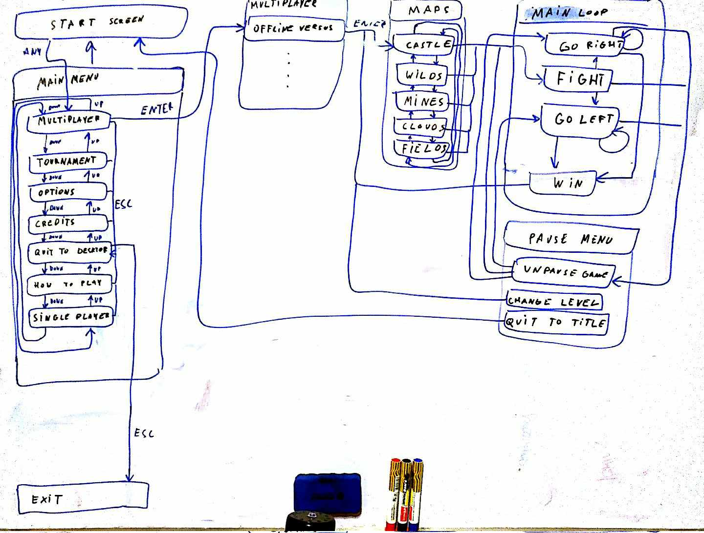

# Nidhogg 

## Menu traverse

The diagram showing a state machine that defines how to get from start screen to the local multiplayer gameplay. It it will be used to automate the process of setting up fights.

The program recognises what state the game is currently by taking a screenshot and doing and operation using masks.

## AI

The goal of this project will be to train two AI swordsman that will be fighting each other. The model who wins survives and fights new model.