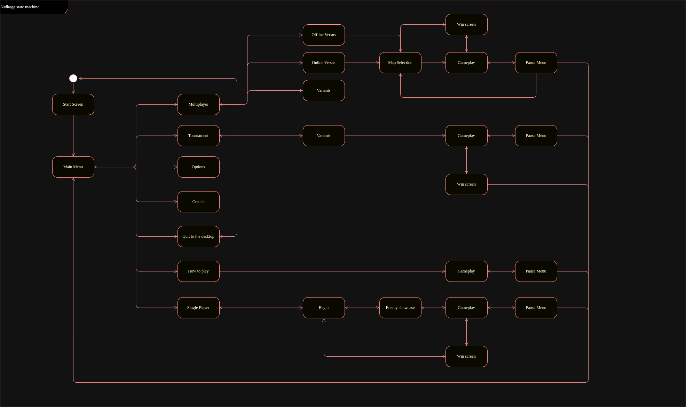

# Nidhogg 

## Menu traverse

State machine that describes the menues of the Nidhogg game.

The program recognises what state the game is currently by taking a screenshot and doing and operation using masks.

## AI

The goal of this project will be to train two AI swordsman that will be fighting each other. The model who wins survives and fights new model.